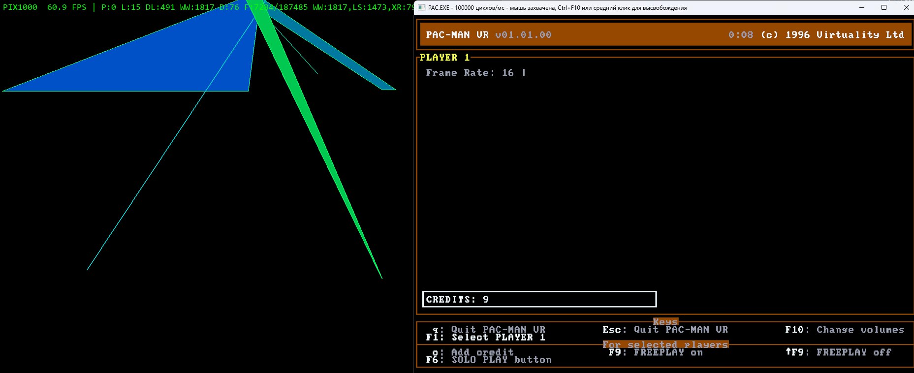
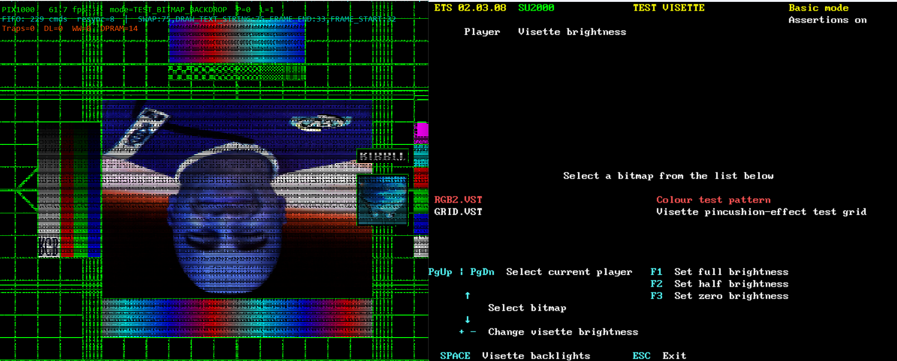
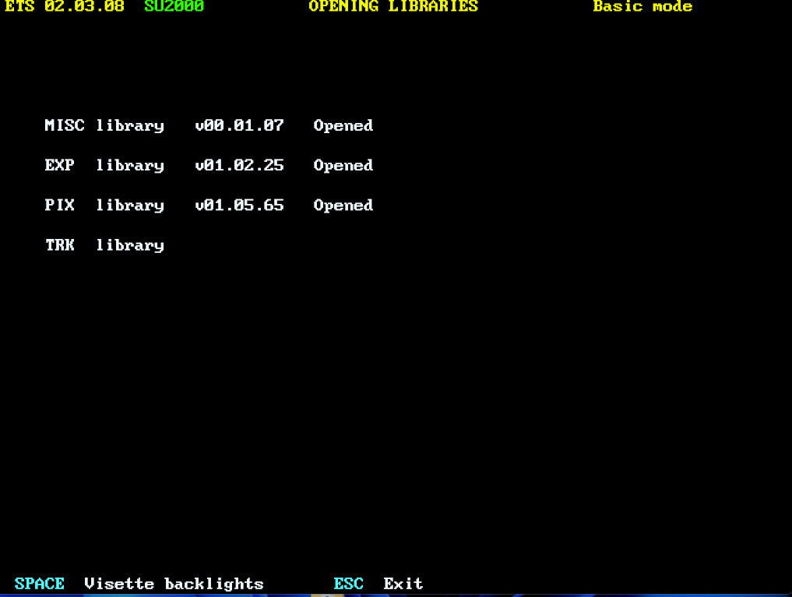

# SU2000, Virtuality Series 2000 & Pac-Man VR (1996) Emulator

[](LICENSE)
[](#system-requirements)
[](#current-compatibility)
[](#how-it-works-architecture)

> **Reverse engineering project and software emulator for the Virtuality 2000 (SU2000) arcade platform, built to preserve and revive lost 1990s VR arcade media including Pac-Man VR (1996), Zone Hunter (1994), Dactyl Nightmare, and the Engineering Test System (ETS).**
RELEASE STATUS: v1.0 Early Alpha (Work In Progress, Known Bugs Present. Last update: 20.08.2026)
• Notice: This is NOT a complete release. 3D rasterization and audio have bugs.
• Dual M88k coprocessor core, DPRAM bus, and 2D video pipelines are almost operational.
• Full 3D polygon renderer, DSP SoundScape audio, and game tuning in active dev.
---

## Table of Contents
- [About the Project](#-about-the-project)
- [Current Compatibility](#-current-compatibility)
- [How It Works (Architecture)](#-how-it-works-architecture)
- [Quick Start Guide](#-quick-start-guide)
- [Folder Structure](#-folder-structure)
- [In-Game Controls & Arcade Guide](#-in-game-controls--arcade-guide)
- [Research Paper & Documentation](#-research-paper--documentation)
- [Future Roadmap](#-future-roadmap)
- [Troubleshooting & FAQ](#-troubleshooting--faq)
- [Acknowledgements & Credits](#-acknowledgements--credits)
- [Legal Disclaimer](#-legal-disclaimer)
- [License](#-license)

---

## About the Project

In 1996, Virtuality Group plc and Namco released **Pac-Man VR** on the Virtuality SU-2000 arcade cabinet. Players wore the Visette 2 stereoscopic VR headset and walked inside a full 3D maze in first-person with 6DOF magnetic head tracking.

Because Virtuality machines used custom proprietary expansion hardware , dual Motorola 88110 RISC coprocessors, a GIGI video line-store rasterizer, Polhemus InsideTRAK magnetic receivers, and Ensoniq SoundScape DSP soundcards, the software could not run on regular PC emulators for nearly thirty years and was classified as lost media.

This project is the result of **120+ hours of continuous reverse engineering** (February, August 2026) by **ErrorDan** (Me), transforming undocumented raw firmware binaries into a functional emulator architecture capable of booting the original master disk dumps.







---

## Current Compatibility

| Game / Title | Status | Details & Progress |
| :--- | :---: | :--- |
| **Pac-Man VR (1996)** | 🟡 **Partially Working** | Full boot sequence, master disk filesystem loading, dual Motorola 88110 firmware execution (`MAINA.OUT` / `MAINB.OUT`), and 60.2 FPS frame synchronization are functional. 3D polygon rasterization and gameplay tuning under active development. Still it need another PIX1000 Emulator which is already inside this game on archive org |
| **ETS Diagnostic Suite** | 🟡 **Working (2D / Bus Scan)** | Hardware discovery and ISA card enumeration complete. 2D focus calibration test pattern functional in development builds (dont know why but it wont work anymore for now); hardware self-test menus almost operational. |
| **Zone Hunter (1994)** | 🟡 **In Progress** | Full ROM filesystem support, firmware load, and initial I/O handshake operational. |
| **Dactyl Nightmare** | **No Progress** | |

---

## How It Works (Architecture)

The SU2000 system splits work between a host PC and dedicated RISC graphics coprocessors. The emulator recreates this pipeline in real-time:

```
┌─────────────────────────────────────────────────────────────┐
│                       Custom DOSBox Host PC                 │
│   Runs 16-bit / 32-bit DOS Binaries (PAC.EXE, ETS.EXE)      │
│   Hooks Hardware I/O Ports: 0x300..0x37F, 0x270..0x27F      │
└──────────────────────────────┬──────────────────────────────┘
                               │
            Local TCP Socket Bridge (127.0.0.1:7320)
                               │
┌──────────────────────────────▼──────────────────────────────┐
│                    Python Emulation Core                    │
│  ├── Dual Motorola 88110 RISC Interpreter (MAINA / MAINB)   │
│  ├── 4MB Shared DPRAM / VRAM MMIO Window (0xD0000)          │
│  ├── 2K×16-bit Command FIFO Handler (Port 0x320)            │
│  ├── GIGI Line-Store Rasterizer & Span Generator            │
│  └── 60 Hz VSYNC Interrupt Injection Thread                 │
└──────────────────────────────┬──────────────────────────────┘
                               │
┌──────────────────────────────▼──────────────────────────────┐
│               Pygame-CE Stereoscopic Display                │
│       Renders WidePAL (1024x768) Viewport with Diagnostics   │
└─────────────────────────────────────────────────────────────┘
```

1. **DOSBox Host:** Executes the original MS-DOS game binaries and hooks MMIO access at `0xD0000` and I/O ports `0x300..0x37F` (PIX1000/VID1000) and `0x270..0x27F` (Polhemus Tracker).
2. **TCP Hardware Bridge:** Streams hardware register reads, writes, and FIFO command packets to `127.0.0.1:7320` with zero lag.
3. **Python Emulation Core:** Executes native M88k COFF firmware binaries (`MAINA.OUT` / `MAINB.OUT`), maintains DPRAM mailboxes, and generates spans for the GIGI video processor.

---

## Quick Start Guide

### 1. Download
* Download the latest release zip archive from [archive.org](https://archive.org) or GitHub Releases.
* Extract the folder to your computer (e.g. `C:\SU2000`).

### 2. Launch
1. Double-click **`SU2000.exe`** to start the launcher.
2. Use **Up/Down arrow keys** to select your game (e.g., *Pac-Man VR*).
3. Press **Enter** or click **[ LAUNCH GAME ]**.

> [!NOTE]  
> **Safe Execution Notice:**  
> The program is 100% safe and virus-free. When launching a game, background Command Prompt / PowerShell windows will open automatically. This is completely normal and required to use the internal DOSBox engine and the Python TCP socket bridge simultaneously.

---

## Folder Structure

The project is structured to keep all files organized:

```
SU2000/
├── SU2000.exe            # Standalone launcher application
├── APPS/                 # Game folders and ROM dumps
│   ├── Pac-Man VR/       # Pac-Man VR (1996) binaries & firmware
│   ├── ETS Diagnostic/   # Engineering Test System suite
│   ├── Zone Hunter/      # Zone Hunter (1994)
│   └── Dactyl Nightmare/ # Dactyl Nightmare arcade files
├── HEART/                # Clean-Room Emulation Core & Engine files
│   ├── pix1000_emulator.py
│   ├── m88k_interpreter.py
│   ├── dosbox.exe
│   └── SU2000_RESEARCH_PAPER.pdf  # Comprehensive 7-page research report
└── MEDIA/                
```

---

## In-Game Controls & Arcade Guide

### Launcher Hotkeys
* <kbd>Enter</kbd> / <kbd>Space</kbd> : Launch selected game
* <kbd>F2</kbd> : Open game folder in File Explorer
* <kbd>F5</kbd> : Emergency engine reset (terminates orphan background emulator processes)
* <kbd>Tab</kbd> / <kbd>1</kbd>-<kbd>4</kbd> : Switch menu tabs (Games, Controls, Media, About)
* <kbd>Esc</kbd> : Exit launcher

### Pac-Man VR (Operator & Arcade Modes)
When booting into the arcade operator screen:
1. Click inside the **DOSBox** window to focus.
2. Press <kbd>F1</kbd> to select **PLAYER 1** (highlights player slot).
3. Press <kbd>F9</kbd> to enable **FREEPLAY** (or press <kbd>C</kbd> to insert coin credit).
4. Press <kbd>F6</kbd> (SOLO PLAY button) or <kbd>Enter</kbd> to start the game session!

---

## Research Paper & Documentation

A complete, 7-page technical research paper is bundled directly with the emulator in [`HEART/SU2000_RESEARCH_PAPER.pdf`](HEART/SU2000_RESEARCH_PAPER.pdf).

It covers:
* Historical background of Virtuality Group plc and the Cyberbase SU-2000 cabinet.
* 40-hour disassembly breakdown of the early alpha build and the discovery of Motorola 88110 firmware.
* Hardware registers, GIGI span formats, and DPRAM memory map.
* Author's hands-on research trip to the **Computerspielemuseum in Berlin** (playing *Zone Hunter* on original SU-2000 hardware).
* Pair-programming methodology with modern AI reasoning models (*Claude Sonnet 4.6*, *GPT Sol 5.6*, *Gemini 3.7 Flash*).

---

## Future Roadmap

- [ ] **Complete 3D Polygon Rasterizer:** Full texture mapping and perspective-correct rendering for DMOD/MBIN models.
- [ ] **Modern VR Support:** SteamVR and OpenXR integration (Meta Quest 3, Valve Index, Bigscreen Beyond) with room-scale tracking.
- [ ] **SoundScape DSP Emulation:** Software emulation for the Ensoniq DSP audio processor on ports `0x330`/`0x350`.
- [ ] **Multi-Cabinet ARCnet Link:** Virtual network emulation on port `0x280` for 2-player multiplayer duels.

---

## Troubleshooting & FAQ

<details>
<summary><b>Q: My antivirus flags the EXE as an unrecognized application.</b></summary>
This is a standard false positive caused by PyInstaller packaging. The project is completely open and safe. You can inspect all Python source files in the <code>HEART/</code> directory.
</details>

<details>
<summary><b>Q: Windows Firewall asks for network access on startup.</b></summary>
The emulator uses a local TCP loopback connection on <code>127.0.0.1:7320</code> to transfer hardware I/O commands between DOSBox and the Python backend. Allow local/private network access.
</details>

<details>
<summary><b>Q: The game closed unexpectedly and won't restart.</b></summary>
Press <kbd>F5</kbd> in the launcher to perform an Emergency Engine Reset, which terminates any lingering background DOSBox or Python processes.
</details>

---

## Acknowledgements & Credits

Special thanks to the archivists, researchers, and community members who made this preservation effort possible:

* **Claude and Gemini** - For fastest results with vibecoding.

* **Prof. Dr. Jens-Martin Loebel** (*Hochschule Magdeburg-Stendal / Humboldt University of Berlin*) - Author of foundational 2011 research on SU-2000 restoration.
* **Computerspielemuseum Berlin** - For preserving surviving operational SU-2000 hardware.
* **Embracer Games Archive** (*Karlstad, Sweden*) & **CIN-ergy** (*Leeuwarden, Netherlands*) - For research materials and archive support.
* **SailorSat** - For discovering and preserving the master v01.01.00 disk dump and native M88k firmware.
* **simzy39** & **PACNATIC** - historical details, preservation and community collaboration.
* **iteractiv** - For technical insights and support.
* **ErrorDan Subscribers (My subs :D)** - For inspiring and motivating this project from the very first video comment.

---

## Legal Disclaimer

This is a **non-commercial, digital preservation and educational research project** developed under the **Fair Use** doctrine. 
* This repository contains **NO** copyrighted game ROMs or proprietary assets (check archive org).
* **PAC-MAN** is a registered trademark and copyright of **BANDAI NAMCO Entertainment Inc.**
* **Virtuality**, **SU2000**, **SD2000**, and **Visette** are trademarks and properties of their respective copyright holders.

---

## License

This project is licensed under the **[MIT License](LICENSE)** — see the LICENSE file for details.
